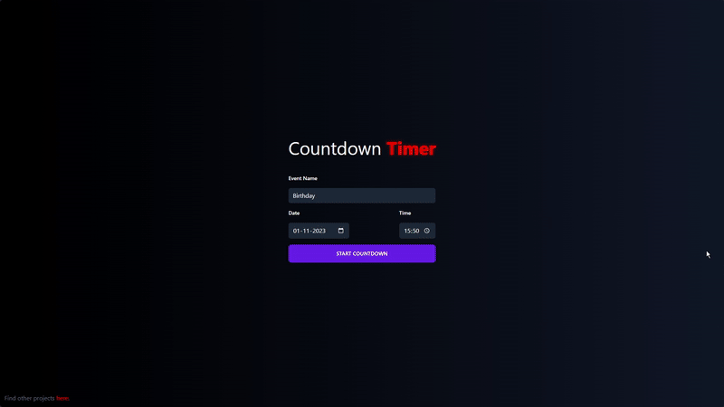

# Countdown Timer
Countdown Timer is an elegant, user-friendly application designed to help you track time until your special events. Whether you're counting down to a birthday, an important meeting, or a much-anticipated holiday, the Countdown Timer ensures you won't miss a single moment.

## Features
- **Beautiful Looks**: A visually appealing interface that's not only easy on the eyes but also enhances user experience.
- **Event Name, Date, and Time Entry**: Personalize your countdown by entering the name, date, and time of your event.
- **Toast Notifications**: Alerts acting as feedback during event creation.
- **Particle Effects for Finished Countdowns**: Celebrate the arrival of your event with delightful particle effects, adding a touch of magic to your moment.
- **Minimalistic Design**: A clean, simple layout that focuses on functionality, making it easy to use for everyone.

[Try it out!](https://berkanktk.github.io/SimpleCountdown/)